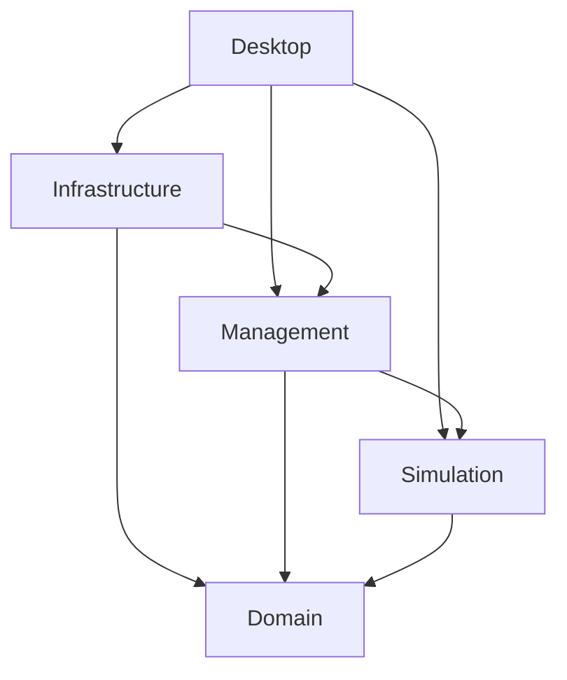

# Architecture

HockeySim is a single-player, offline management game. Game operations run
without a desktop UI; the user manages a team rather than directly controlling
athletes during matches. A future match viewer may present simulation output.

## Project responsibilities

| Project | Responsibility |
| --- | --- |
| `HockeySim.Domain` | Domain objects, value types, and invariants that must always hold. Controlled operations protect validity; callers cannot bypass them through mutable collections. |
| `HockeySim.Simulation` | Match calculations. Accepts match inputs and controlled randomness, maintains internal match state, and returns a result. |
| `HockeySim.Management` | Game workflows, world generation, season orchestration, and applying match results through Domain operations. Exposes game-state commands and read-only snapshots. |
| `HockeySim.Infrastructure` | Save/load, serialization, file access, and other external data access. Implements persistence contracts consumed by Management. |
| `HockeySim.Desktop` | Avalonia views, presentation state, view models, and startup wiring. Sends game-state changes to Management and displays its snapshots. |

Domain enforces validity; Management coordinates operations; Simulation
calculates match outcomes. Neither UI behavior nor storage details belong in
those core responsibilities.

## Dependencies and interaction

The intended project dependency direction is:



Management owns the persistence contracts it needs; Infrastructure implements
them. Domain has no dependency on the other application projects. Management
and Simulation have no dependency on Desktop or Infrastructure. Keep framework
and storage-specific types out of core interfaces.

Desktop's references to Infrastructure and Simulation serve startup composition.
Use ordinary constructors and manual wiring there. Views and view models use
Management's interface; they do not invoke the match engine, storage, or live
Domain mutation methods directly. Snapshots expose only read-only data, without
mutable references back into the game world. Shape snapshots for callers rather
than copying the entire model indiscriminately.

Simulation returns a match result instead of changing the persistent game world.
Management applies that result through Domain operations. See
[the ownership decision](adr/0001-headless-game-ownership.md).

## Randomness and saves

Within the same engine version, the same starting state, random state, and
sequence of management actions produce the same result. Preserve hidden random
state in saves so reloading and repeating actions does not reroll an outcome.
Keep outcome-affecting randomness and time inputs under explicit control.
Reproducibility is not a promise across engine versions or protection against
editing local saves. See [the rationale](adr/0002-reproducible-saves.md).

Pre-release saves may become incompatible. Version the save format and reject
unsupported versions clearly. Choose the format and storage technology during
the first persistence feature, using representative data and access patterns.
Establish a longer-term compatibility policy before the first stable release.

## Repository structure

Production projects live in `src/`; matching test projects live in `tests/`:

```text
src/HockeySim.<Responsibility>/
tests/HockeySim.<Responsibility>.Tests/
docs/
  adr/
  agents/
CONTEXT.md
```

Use the five responsibilities in the table above. Add projects to
`HockeySim.slnx` when they are scaffolded. Within a project, group related files
by feature or domain responsibility, such as a view and view model together
under `Roster/`. Keep small projects flat until grouping is useful. Name folders
for their responsibility instead of creating generic `Helpers` or `Managers`
collections. Namespaces follow the owning project and folder.

## Current implementation

Domain, Management, and Desktop exist today. Domain protects generated-world
invariants through validated construction and read-only collections. Management
owns a headless new-game workflow, controlled random state, managed-team
selection, and read-only snapshots. Fictional names are kept separate from the
league and roster rules that use them.

Desktop remains a console placeholder and references Management for future
startup composition. Simulation and Infrastructure have not been scaffolded;
until they exist, the related parts of the diagram remain target architecture.
