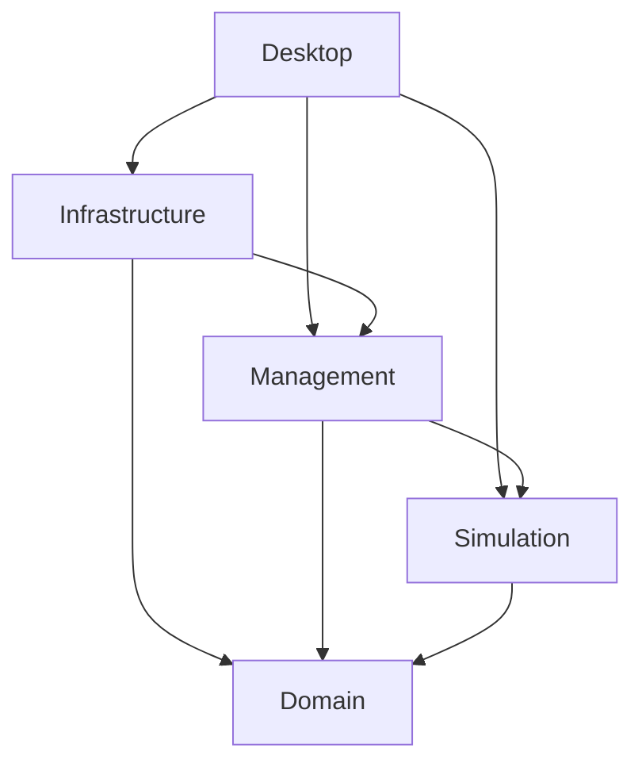

# Architecture

HockeySim is a single-player, offline management game. Game operations run
without a desktop UI; the user manages a team rather than directly controlling
athletes during matches. A future match viewer may present simulation output.

## Project responsibilities

| Project | Responsibility |
| --- | --- |
| `HockeySim.Domain` | Domain objects, value types, and invariants that must always hold. Controlled operations protect validity; callers cannot bypass them through mutable collections. |
| `HockeySim.Simulation` | Match calculations. Accepts match inputs and controlled randomness, maintains internal match state, and returns a result. |
| `HockeySim.Management` | Game workflows, world generation, season orchestration, and applying match results through Domain operations. Exposes game-state commands and read-only snapshots. |
| `HockeySim.Infrastructure` | Save/load, serialization, file access, and other external data access. Implements persistence contracts consumed by Management. |
| `HockeySim.Desktop` | Avalonia views, presentation state, view models, and startup wiring. Sends game-state changes to Management and displays its snapshots. |

Domain enforces validity; Management coordinates operations; Simulation
calculates match outcomes. Neither UI behavior nor storage details belong in
those core responsibilities.

## Dependencies and interaction

The intended project dependency direction is:


```mermaid
flowchart TD
    Desktop --> Management
    Desktop --> Infrastructure
    Desktop --> Simulation
    Infrastructure --> Management
    Infrastructure --> Domain
    Management --> Simulation
    Management --> Domain
    Simulation --> Domain
```

Management owns the persistence contracts it needs; Infrastructure implements
them. Domain has no dependency on the other application projects. Management
and Simulation have no dependency on Desktop or Infrastructure. Keep framework
and storage-specific types out of core interfaces.

Desktop's references to Infrastructure and Simulation serve startup composition.
Use ordinary constructors and manual wiring there. Views and view models use
Management's interface; they do not invoke the match engine, storage, or live
Domain mutation methods directly. Snapshots expose only read-only data, without
mutable references back into the game world. Shape snapshots for callers rather
than copying the entire model indiscriminately.

Simulation returns a match result instead of changing the persistent game world.
Management applies that result through Domain operations. See
[the ownership decision](adr/0001-headless-game-ownership.md).

## Randomness and saves

Within the same engine version, the same starting state, random state, and
sequence of management actions produce the same result. Preserve hidden random
state in saves so reloading and repeating actions does not reroll an outcome.
Keep outcome-affecting randomness and time inputs under explicit control.
Simulation owns the single deterministic generator (`ControlledRandom`) and its
persistable `RandomState`; Management uses the same generator for world
generation and passes the state to and from match simulation.
Reproducibility is not a promise across engine versions or protection against
editing local saves. See [the rationale](adr/0002-reproducible-saves.md).

Pre-release saves may become incompatible. Version the save format and reject
unsupported versions clearly. Choose the format and storage technology during
the first persistence feature, using representative data and access patterns.
Establish a longer-term compatibility policy before the first stable release.

## Repository structure

Production projects live in `src/`; matching test projects live in `tests/`:

```text
src/HockeySim.<Responsibility>/
tests/HockeySim.<Responsibility>.Tests/
docs/
  adr/
  agents/
CONTEXT.md
```

Use the five responsibilities in the table above. Add projects to
`HockeySim.slnx` when they are scaffolded. Within a project, group related files
by feature or domain responsibility, such as a view and view model together
under `Roster/`. Keep small projects flat until grouping is useful. Name folders
for their responsibility instead of creating generic `Helpers` or `Managers`
collections. Namespaces follow the owning project and folder.

## Current implementation

Domain, Management, and Desktop exist today. Domain protects generated-world
invariants through validated construction and read-only collections. Management
owns a headless new-game workflow, controlled random state, managed-team
selection, and read-only snapshots. Fictional names are kept separate from the
league and roster rules that use them.

Management also delivers inbox messages to the user. New-game messages are
derived from the generated managed team, so they never describe state the game
does not hold; selecting a different managed team replaces them with messages
for that team. Marking a message read is a Management command.

A new game also generates the regular-season schedule from the same controlled
random stream, after the league. Domain's `SeasonSchedule` holds scheduled
matches by team identity in date order and rejects a team playing twice on one
date or against itself; Management's generator guarantees the league balance:
four meetings with each divisional opponent, three with each other
same-conference opponent, two with each opposite-conference opponent, and 42
home and 42 away matches per team. Generation has two stages: a meeting planner
decides who plays whom and who hosts, independent of dates, then a calendar
assigns dates. The current calendar packs the meetings into 84 rounds in which
every team plays once, opening on October 1 of the season year with a round
every other day. Authentic NHL dates, travel, rest, and rotation constraints are
not modelled; see [future features](future-features.md#realistic-season-calendar). The schedule is exposed as a read-only
snapshot and is unchanged by managed-team selection.

Domain's `Season` aggregate holds the league, schedule, current date, the
completed-match history, team records, and player season statistics. A new
season's current date is opening day. `CompleteDay` accepts exactly one
completed match for each match scheduled on the current date, validates the
whole day (scheduled teams, decisive scores, statistics that reconcile with the
score, rostered players) before changing anything, and then moves to the next
calendar day; a scheduled match therefore cannot be completed twice, and a day
is never partly applied. Management's `AdvanceDay` command simulates the day's
matches in schedule order from the current lineups on one continuous random
stream, converts each Simulation result into a Domain completed match, and
commits the random state only after the season accepts the day. `GameManager`
serializes its commands, rejects commands issued from inside a day being played,
and rejects advancement once the season is complete. The engine is injected
through Simulation's `IMatchSimulator`; `MatchDecision` lives in Domain because
both the engine and the history use it.

Domain's `Season.RankStandings` ranks any group of league teams by the
[NHL tie-breaking procedure](https://www.nhl.com/info/standings-info/tie-breaking-procedure):
points, fewer games played, regulation wins, regulation and overtime wins, wins,
head-to-head points among the tied clubs, goal differential, then goals for.
It partitions each tied group criterion by criterion rather than sorting
pairwise, because head-to-head depends on which clubs are tied. Head-to-head
excludes the odd game (the first game in the city that hosted the extra meeting
between two clubs) and, for more than two clubs, compares the share of available
points; it is skipped for a group when any tied club has no counted games among
the others. The official text does not say what happens when head-to-head
separates only part of a larger tie; the clubs still level continue to goal
differential rather than recomputing head-to-head among themselves. That choice
is provisional and isolated in `StandingsRanking`. Teams level on every
criterion share a rank and keep league team order. Management exposes league,
conference, and division tables in `SeasonSnapshot.Standings`, each ranked
independently. Playoff qualification is not modelled.

Desktop wires a Management game manager at startup. After the new-game screen
starts a game, a `GameSession` forwards commands (lineup changes, reading
messages, advancing a league day) to Management and publishes each resulting
snapshot to the in-game shell's feature pages: home, inbox, roster, lines,
league teams, and schedule. Only the managed team's lineup is editable, and
Management validates every change. The title bar's Continue button plays the
current league day off the UI thread; the session rejects a second request while
one runs and then publishes Management's latest snapshot, since a command
issued meanwhile waits on Management's lock and may have produced newer state.
A failed day is shown as an error banner; Management applied nothing, so the
pages still show the unplayed day. Once the season is complete, Continue is
disabled and every page remains browsable. The schedule page lists one team's
84 matches with results and opens a completed match's score, decision, and box
score; these are single-match figures, kept apart from season totals.
Colours and control styles live in `HockeySim.Desktop/Theme/`; team identity
colours are dynamic resources so a chosen team's colours can replace the
league defaults later.
Simulation calculates a match statistically from both teams' lineups as they
stand at match start. Player ratings, fixed forward-line and defence-pair usage
weights, and starting-goalie quality drive shots and goals. Tied matches go to
sudden-death overtime and then a shootout. Each goal credits up to two assists to
the scorer's on-ice teammates, and the result carries every appearing player's
match statistics, derived from the goals and shots so they reconcile with the
score; shootout attempts count toward no player. It takes an explicit random state and returns
the state after the match with the result, without changing the teams.
Infrastructure has not been scaffolded; until it exists, the related parts of
the diagram remain target architecture.
