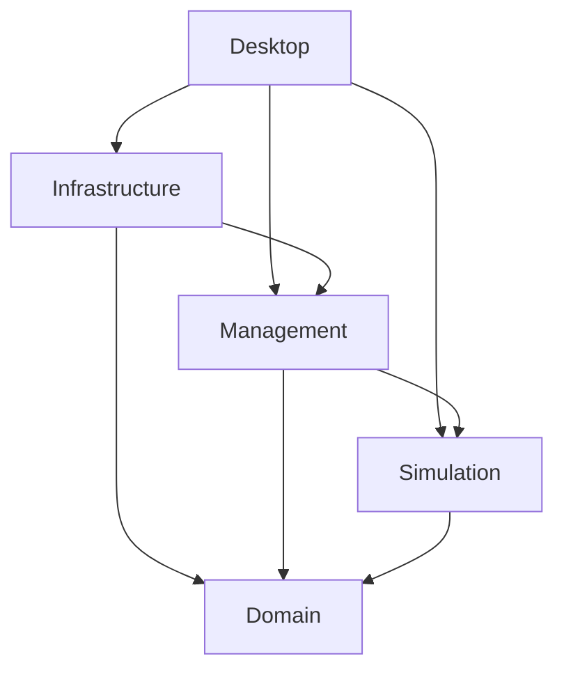

# Architecture

HockeySim is a single-player, offline management game. Game operations run
without a desktop UI; the user manages a team rather than directly controlling
athletes during matches. A future match viewer may present simulation output.

## Project responsibilities

| Project | Responsibility |
| --- | --- |
| `HockeySim.Domain` | Domain objects, value types, and invariants that must always hold. Controlled operations protect validity; callers cannot bypass them through mutable collections. |
| `HockeySim.Simulation` | Match calculations. Accepts match inputs and controlled randomness, maintains internal match state, and returns a result. |
| `HockeySim.Management` | Game workflows, world generation, season orchestration, and applying match results through Domain operations. Exposes game-state commands and read-only snapshots. |
| `HockeySim.Infrastructure` | Save/load, serialization, file access, and other external data access. Implements persistence contracts consumed by Management. |
| `HockeySim.Desktop` | Avalonia views, presentation state, view models, and startup wiring. Sends game-state changes to Management and displays its snapshots. |

Domain enforces validity; Management coordinates operations; Simulation
calculates match outcomes. Neither UI behavior nor storage details belong in
those core responsibilities.

## Dependencies and interaction

The intended project dependency direction is:


```mermaid
flowchart TD
    Desktop --> Management
    Desktop --> Infrastructure
    Desktop --> Simulation
    Infrastructure --> Management
    Infrastructure --> Domain
    Management --> Simulation
    Management --> Domain
    Simulation --> Domain
```

Management owns the persistence contracts it needs; Infrastructure implements
them. Domain has no dependency on the other application projects. Management
and Simulation have no dependency on Desktop or Infrastructure. Keep framework
and storage-specific types out of core interfaces.

Desktop's references to Infrastructure and Simulation serve startup composition.
Use ordinary constructors and manual wiring there. Views and view models use
Management's interface; they do not invoke the match engine, storage, or live
Domain mutation methods directly. Snapshots expose only read-only data, without
mutable references back into the game world. Shape snapshots for callers rather
than copying the entire model indiscriminately.

Simulation returns a match result instead of changing the persistent game world.
Management applies that result through Domain operations. See
[the ownership decision](adr/0001-headless-game-ownership.md).

## Randomness and saves

Within the same engine version, the same starting state, random state, and
sequence of management actions produce the same result. Preserve hidden random
state in saves so reloading and repeating actions does not reroll an outcome.
Keep outcome-affecting randomness and time inputs under explicit control.
Simulation owns the single deterministic generator (`ControlledRandom`) and its
persistable `RandomState`; Management uses the same generator for world
generation and passes the state to and from match simulation.
Reproducibility is not a promise across engine versions or protection against
editing local saves. See [the rationale](adr/0002-reproducible-saves.md).
The engine version is the release version, taken from the Git tag; a source
build is `0.0.0-dev` and promises nothing beyond its own commit. It is
independent of the save format version: a release may or may not change the
save format. See [the release decision](adr/0005-self-contained-desktop-builds.md).

Pre-release saves may become incompatible. The save format is versioned, and a
save from another version is rejected as unsupported rather than migrated. Each
game is saved as one Brotli-compressed JSON file; see
[the format decision](adr/0004-local-save-format.md). Establish a longer-term
compatibility policy before the first stable release.

## Repository structure

Production projects live in `src/`; matching test projects live in `tests/`:

```text
src/HockeySim.<Responsibility>/
tests/HockeySim.<Responsibility>.Tests/
docs/
  adr/
  agents/
CONTEXT.md
```

Use the five responsibilities in the table above. Add projects to
`HockeySim.slnx` when they are scaffolded. Within a project, group related files
by feature or domain responsibility, such as a view and view model together
under `Roster/`. Keep small projects flat until grouping is useful. Name folders
for their responsibility instead of creating generic `Helpers` or `Managers`
collections. Namespaces follow the owning project and folder.

## Current implementation

Domain, Simulation, Management, Infrastructure, and Desktop exist today. Domain
protects generated-world invariants through validated construction and
read-only collections. Management owns a headless new-game workflow,
controlled random state, managed-team selection, and read-only snapshots. Fictional names are kept separate from the
league and roster rules that use them.

Management also delivers inbox messages to the user. New-game messages are
derived from the generated managed team, so they never describe state the game
does not hold; selecting a different managed team replaces them with messages
for that team. Marking a message read is a Management command.

Domain's `Lineup` also holds the special-situation units and two extra
attackers. `SpecialSituationFormat` fixes each situation's unit count and the
skater role of every slot (5-on-4 and 5-on-3: LW C RW / LD RD; 4-on-3, 4-on-5,
and 4-on-4: C W / LD RD; 3-on-5 and 3-on-4: C / LD RD; 3-on-3: C W / D), and
every format has exactly one centre, who takes faceoffs. Lines and pairs still
follow players' positions until any-role lineups (#55), but unit slots and the
extra attackers already take any dressed skater: a slot's role says where the
skater plays, and the match engine is expected to judge how well they suit it.
The lineup rejects a unit that holds a goalie, a scratched skater, or the same
player twice, and a lineup without exactly the required units. Generated teams
get line-derived defaults from `Lineup.CreateWithDefaultUnits`, which lives in
Domain because it is a deterministic function of the lines and every test
project's lineup helpers reuse it: power plays, four-on-four, and three-on-three
draw on the top lines and pairs, penalty kills on the second to fourth lines'
centres and left wings, and the first two centres are the extra attackers.
Management's `SetLineup` replaces the whole lineup, units included, so a lines
change that scratches a unit player is rejected unless its units change too.
The event engine plays every strength state that penalties create with the
matching units (see [Penalties and special teams](#penalties-and-special-teams))
and sends on an extra attacker whenever a goalie is pulled, during a delayed
penalty or late in a match (see [Pulling the goalie](#pulling-the-goalie)).

A new game also generates the regular-season schedule from the same controlled
random stream, after the league. Domain's `SeasonSchedule` holds scheduled
matches by team identity in date order and rejects a team playing twice on one
date or against itself; Management's generator guarantees the league balance:
four meetings with each divisional opponent, three with each other
same-conference opponent, two with each opposite-conference opponent, and 42
home and 42 away matches per team. Generation has two stages: a meeting planner
decides who plays whom and who hosts, independent of dates, then a calendar
assigns dates. The current calendar packs the meetings into 84 rounds in which
every team plays once, opening on October 1 of the season year with a round
every other day. Authentic NHL dates, travel, rest, and rotation constraints are
not modelled; see [future features](future-features.md#realistic-season-calendar). The schedule is exposed as a read-only
snapshot and is unchanged by managed-team selection.

Domain's `Season` aggregate holds the league, schedule, current date, the
completed-match history, team records, and player season statistics. A new
season's current date is opening day. `CompleteDay` accepts exactly one
completed match for each match scheduled on the current date, validates the
whole day (scheduled teams, decisive scores, statistics that reconcile with the
score, rostered players) before changing anything, and then moves to the next
calendar day; a scheduled match therefore cannot be completed twice, and a day
is never partly applied. Management's `AdvanceDay` command simulates the day's
matches in schedule order from the current lineups on one continuous random
stream, converts each Simulation result into a Domain completed match, and
commits the random state only after the season accepts the day. `GameManager`
serializes its commands, rejects commands issued from inside a day being played,
and rejects advancement once the season is complete. The engine is injected
through Simulation's `IMatchSimulator`; `MatchDecision` lives in Domain because
both the engine and the history use it.

Domain's `Season.RankStandings` ranks any group of league teams by the
[NHL tie-breaking procedure](https://www.nhl.com/info/standings-info/tie-breaking-procedure):
points, fewer games played, regulation wins, regulation and overtime wins, wins,
head-to-head points among the tied clubs, goal differential, then goals for.
It partitions each tied group criterion by criterion rather than sorting
pairwise, because head-to-head depends on which clubs are tied. Head-to-head
excludes the odd game (the first game in the city that hosted the extra meeting
between two clubs) and, for more than two clubs, compares the share of available
points; it is skipped for a group when any tied club has no counted games among
the others. The official text does not say what happens when head-to-head
separates only part of a larger tie; the clubs still level continue to goal
differential rather than recomputing head-to-head among themselves. That choice
is provisional and isolated in `StandingsRanking`. Teams level on every
criterion share a rank and keep league team order. Management exposes league,
conference, and division tables in `SeasonSnapshot.Standings`, each ranked
independently. Playoff qualification is not modelled.

Desktop wires a Management game manager at startup. After the new-game screen
starts a game, a `GameSession` forwards commands (lineup changes, reading
messages, advancing a league day) to Management and publishes each resulting
snapshot to the in-game shell's feature pages: home, inbox, roster, lines,
league teams, standings, and schedule. Only the managed team's lineup is editable, and
Management validates every change. The lines page shows any team's lineup, read-only
for other clubs, on tabs for even strength, power play, penalty kill, and the
other situations (4-on-4, 3-on-3, extra attacker); each unit shows its forwards
in front of its defence. Choosing a player already in the same line set, unit, or
extra-attacker pair swaps the two; dressing a scratched player hands them the
replaced player's unit slots. Unsaved edits survive browsing other teams. The title bar's Continue button plays the
current league day off the UI thread; the session rejects a second request while
one runs and then publishes Management's latest snapshot, since a command
issued meanwhile waits on Management's lock and may have produced newer state.
A failed day is shown as an error banner; Management applied nothing, so the
pages still show the unplayed day. Once the season is complete, Continue is
disabled and every page remains browsable. The schedule page lists one team's
84 matches with results and opens a completed match's score, decision, and box
score; these are single-match figures, kept apart from season totals. The box
score lists each team's skaters (goals, assists, points, plus/minus, time on ice,
shots, shot attempts, xG, hits, blocks, faceoffs won and lost, takeaways,
giveaways, penalty minutes, power-play and shorthanded goals) and starting goalie
(shots and goals against, saves, save percentage, xG against, time on ice), and
each team's power play (goals of opportunities) and penalty minutes under its
shots; the two teams are stacked, away first, because each table needs the full
width.
The standings page presents Management's division, conference, or league tables
as ranked, without re-sorting them. Roster tables for every team switch between
ratings and current-season totals (skater GP/G/A/P, goalie GP/SA/SV/GA/SV%), and
the player profile always shows the totals. A player who has not appeared shows
zeros, and a save percentage or points percentage is a dash until it is defined.
Pages rebuild from whichever snapshot the session last published.
Colours and control styles live in `HockeySim.Desktop/Theme/`; team identity
colours are dynamic resources so a chosen team's colours can replace the
league defaults later.
Simulation plays a match as play-by-play hockey events from both teams' lineups
as they stand at match start; see [Match engine](#match-engine). It takes an
explicit random state and an `OvertimeFormat`, and returns the state after the
match with the result, without changing the teams. Management plays every
league match with regular-season overtime.
Management saves and loads games through its own contracts in `Saves/`: the
`GameSave` model and the `IGameSaveStore` interface. `SaveGame` copies the
world, lineups (with their units and extra attackers), schedule, current date, completed matches (with
their full box scores, time on ice in whole seconds), inbox, and random
state into a detached save, then hands it to the store. The play-by-play is not
saved. Save format version 4 added the event engine's box-score statistics,
version 5 penalty minutes, power-play and shorthanded goals and assists, and
power-play opportunities, and version 6 empty-net goals. `LoadGame` rebuilds the
league through Domain constructors and replays each saved league day through
`Season.CompleteDay`, so a loaded game is held to the same invariants as a
played one, and team records, season statistics, and standings are derived
from the history rather than read from the file. The active game is replaced
only after the whole save has been rebuilt; an unreadable, unsupported, or
invalid save raises a `GameSaveException` and leaves the active game
unchanged. Continuing a loaded game with the same commands gives the same
results as uninterrupted play within one engine version.
Infrastructure's `GameSaveFile` implements the store for one local file. It
writes the format name and version ahead of the game, serializes the save model
with source-generated System.Text.Json, and writes through a temporary file
that replaces the earlier save only once complete. Management's
`ISavedGameLibrary` lists named saves and opens the store for a `SaveName`;
Infrastructure's `GameSaveDirectory` implements it as one file per save in the
user's application-data folder, named after the save. Save names are limited to
characters that are portable in file names and ignore letter case, so the same
saves appear on every file system. Storage failures (a missing file, a locked
folder, a full disk) surface as `GameSaveStorageException`, another
`GameSaveException`, so callers see only Management's types.

Desktop composes `GameSaveDirectory` with the game manager at startup. The
title bar's Save Game button saves under a typed or chosen name, and the startup
menu's Load Game screen lists the saves. A `GameSession` tracks whether the game
has changed since it was last saved or loaded; overwriting an existing save, and
anything that would discard unsaved progress (loading, starting a new game,
exiting, or closing the window), asks first through a confirmation shown over
every screen. Saving and leaving for the menu wait while a day is being played,
so a day cannot complete into a game that has since been replaced. Save and load
failures are shown where they happened; a failed load leaves the game in
progress as it was. A successful load builds a new session and shell from the
loaded snapshot rather than refreshing the old pages, because a loaded game may
be a different league with different teams and players, and no selection or
unapplied lineup edit should carry over. Saving stays available once the
season is complete. The startup menu shows the running version.

Releases publish `HockeySim.Desktop` as a self-contained, single-file build
named `HockeySim` for each supported runtime identifier; ordinary builds stay
framework-dependent. See
[the deployment decision](adr/0005-self-contained-desktop-builds.md).

### Match engine

`MatchSimulator` plays a match on a game clock in whole seconds as a sequence of
possession steps. In each step the team with the puck tries to move it from its
own zone through the neutral zone into the attacking zone and create a shot,
and the defending team tries to win it back. A step can exit or enter a zone
(carrying the puck in starts a rush; a dump-in is contested), cycle, end in a
shot attempt, a hit, or a turnover, or stop play for icing, offside, a frozen
puck, or a puck out of play. Every stoppage and period start is restarted with a
faceoff between the centres on the ice, decided by their faceoff ratings, and
its location (centre ice or either team's zone) decides who starts where.
Outcome chances are base rates shifted in log-odds by the gap between the
attackers' offence and the defenders' defence, so stronger units shoot more and
turn the puck over less. Turnovers are recorded as the defender's takeaway or
the carrier's giveaway only some of the time; the rest are loose pucks credited
to nobody, as in NHL scoring.

Play is five-on-five in regulation unless penalties are being served (see
[Penalties and special teams](#penalties-and-special-teams)). At five-on-five,
forward lines and defence pairs rotate independently; every other strength
state rotates the lineup's units for it. Each skater's energy falls on the ice and recovers on the bench,
at rates set by stamina, and a tired skater plays below their ratings. A group
changes when it tires or has been out for a long shift, on the fly when its team
is not attacking or at a stoppage once it has been out a while; the coach then
sends out the rested group furthest behind its target share of ice time (forward
lines 36/30/21/13%, pairs 40/34/26%). Higher lines therefore play more, and a
low-stamina group has shorter shifts and plays less. Skaters recover partly in
each intermission.

A shot attempt draws a context (see below) and a shooter from the skaters on
the ice: forwards from the slot, defence from the point, better attackers more
often. A defending skater may block it, more likely for a point shot and for a
good shot blocker. An unblocked attempt may miss the net, depending on the
shooter's accuracy, and a shot on goal beats the goalie depending on the
shooter's finishing and the goalie's reflexes and positioning. A save may give
up a rebound, less often for a goalie with good rebound control, which the
attackers can shoot again within a second or two. Each goal credits up to two
assists to on-ice teammates, favouring playmakers. Hits come from the defending
team, more often and more effectively for skaters with high checking,
toughness, and size; size moves physicality by about a rating point per inch
over 6'1" and per four pounds over 200 lb, within limits, and also helps a puck
carrier keep the puck through a hit.

The tuning values live together in `Simulation/Play/MatchTuning.cs`, measured
from a reference rating of 65, the centre of generated talent. They are
provisional: in a generated league's season, teams average about 3.3 goals
(0.65 on the power play), 30 shots, 3.0 power-play opportunities at a 22% success
rate, and 8.6 penalty minutes each, with about 0.2 fights, 0.03 penalty shots, and
0.22 empty-net goals a match, but 81% of matches end in regulation against about
77% in the NHL. Calibration to NHL averages is #53.

A match tied after regulation is decided by its `OvertimeFormat`. Regular-season
overtime is five minutes of three-on-three sudden death with the lineup's
three-on-three units, then a shootout: three rounds, then sudden-death rounds,
with shooters in order of shootout strength (accuracy and puck control) against
the goalie's goaltending; a skater ejected or still serving a penalty when
overtime ends does not shoot. Playoff overtime is as many twenty-minute
five-a-side sudden-death periods as it takes, with no shootout. Regulation is
played identically under either format. Penalties carry over from regulation
into either overtime. Goalies are pulled to tie a match only in regulation.

#### Penalties and special teams

Penalties come from the play. In each step of possession the defending team
may foul (more often when it is being beaten on skill, the manpower advantage
aside) and the attacking team may too, each more often when its skaters on the
ice are undisciplined or tired, since fatigue lowers effective discipline. The
offender is drawn from the skaters on the ice, favouring the undisciplined, and
the infraction from the situation: hooking, tripping, holding, and interference
against a rush; those and stick fouls, cross-checking, and roughing in the
defending zone; delay of game (over the glass) by a team with the puck in its own
zone. Some high-sticking is a double minor, and a dangerous foul is sometimes a
major, which always carries a game misconduct (an ejection) unless it is for
fighting. After a hit, the hitter may be penalized (boarding, charging,
elbowing, roughing, interference), the two players may take coincidental
roughing minors in a scrum (sometimes with ten-minute misconducts), or the
toughest skater of the hit team may fight the hitter, more likely between tough
players and in a match three or more goals apart; both fighters take five-minute
majors. Neither fights nor scrums happen in overtime. A foul from behind on a
rush is sometimes awarded a penalty shot instead: the fouled team's shooter
alone against the goalie, decided like a shootout attempt.

A foul by the team with the puck stops play at once. A foul by the other team is
a delayed penalty: the team with the puck pulls its goalie for its first
available extra attacker and plays six skaters until the offenders touch the
puck or play stops, then the penalty is called with the faceoff in the
offenders' zone. A goal in that time wipes out a minor (and one minor of a double
minor); a delayed penalty still pending as a period ends is called then.

`PenaltyBox` keeps the timed penalties on the game clock, so they carry over
between periods. A team serves at most two penalties that leave it short at
once; a further one waits and starts, at its full length, when one ends. A
power-play goal ends the conceding team's running minor with the least time
left (only the current half of a double minor), never a major. Penalties on
both teams at one stoppage are coincidental and leave neither team short,
except one minor each at full strength with no other penalties, which plays
four-on-four. Misconducts never leave a team short, and start once the player's
other penalties are over. In regulation and playoff overtime a team has five
skaters less its penalties; in regular-season overtime it has three plus one for
each penalty the opponent serves beyond its own, so a penalty there makes
four-on-three, and a team never has fewer than three. Each strength state
(5-on-4, 5-on-3, 4-on-3 and their penalty-kill sides, 4-on-4, 3-on-3) plays the
lineup's units for it, the first power-play unit 60% of the time when rested and
the 4-on-5 units 40/35/25%. A skater in the box or ejected cannot go on; the
most rested available skater of the same kind (forward or defence) takes the
place in their group. Each extra skater on the ice adds to the attackers' edge,
so power plays shoot more from better ice, and a team killing a penalty may ice
the puck. Penalties are not called on a team with fewer than eight available
skaters, so a substitute always exists. Goalie and bench penalties and
instigator rules are not modelled (see
[future features](future-features.md#goalie-bench-and-instigator-penalties)),
nor are suspensions ([off-ice events](future-features.md#off-ice-events)).

#### Pulling the goalie

Late in the third period a team trailing by one goal pulls its goalie with two
minutes left, and a team trailing by two with three and a half, close to recent
NHL averages; the timing is a tuning value until
[tactics](future-features.md#tactics-and-formations) let the user choose it. It
pulls once it has the puck outside its own zone, or for a faceoff in the
attacking zone. The goalie comes back for a faceoff in the team's own zone and
after any goal, and goes out again while the rule still applies, so a team that
scores to trail by one, or concedes to trail by two, pulls again. A team that is
tied, ahead, or three or more behind never pulls, and the goalie returns when
regulation ends.

The extra attacker joins whatever strength state the penalties allow, exactly as
during a delayed penalty: the team keeps rotating the lines, pairs, or units for
that state and adds the first of the lineup's two extra attackers who is
available and not already on the ice. A five-on-four power play therefore
becomes six-on-four, and a team killing a penalty plays five-on-five. Manpower,
and so a goal's situation, still comes from the penalties being served
([ADR 0007](adr/0007-manpower-from-penalties-served.md)): a goal by six skaters
against five is at even strength, and an empty-net goal against a team that
pulled its goalie while shorthanded is a power-play goal. The extra skater adds
to the attackers' edge like any other.

Every shot attempt at an empty net that reaches it scores. The leading team also
shoots for the empty net from its own zone or the neutral zone, reaching it less
often; a miss from its own zone is icing unless it is killing a penalty. A foul
from behind on a rush at an empty net is an ordinary penalty rather than a
penalty shot; awarded goals are not modelled. Between evenly matched teams about
one pull in seven ties the match and four in ten concede an empty-net goal.

#### Play-by-play and match statistics

The `MatchResult` carries the play-by-play: faceoffs, shot attempts (saved,
missed, or blocked), goals, hits, takeaways, giveaways, and penalties, each
with its period, time, strength state, and the players on the ice for both
sides; a goalie pulled for an extra attacker is shown as an empty net. A
penalty records the team, skater, infraction, and kind (minor, double minor,
major, misconduct, game misconduct, or penalty shot) at the whistle; a fight is
a fighting major to each fighter. A goal records its situation: even strength,
power play, or shorthanded, decided by the penalties being served rather than by
who is on the ice, so an extra attacker during a delayed penalty does not make
a power play; or a penalty shot, which counts as neither, ends no penalty, and
is unassisted. Only
Simulation holds the play-by-play; Management keeps the box score in the
completed match and saves, and Desktop shows the box score. Every individual
statistic is derived from the play-by-play, except time on ice, which comes from
the shifts, and power-play opportunities, which come from the penalties being
served, so they reconcile by construction. Skaters record goals, assists,
plus/minus (goals for less goals against while on the ice, excluding power-play
and penalty-shot goals), time on ice, shots on goal, shot attempts, hits,
blocked shots, faceoffs won and lost, takeaways, giveaways, individual xG,
penalty minutes, power-play and shorthanded goals and assists, and empty-net
goals (scored while the opponent's goalie was pulled). A team
records its power-play opportunities: each opponent penalty counts once, the
first time the team has more skaters while it is served, so a 5-on-3 is two and
coincidental penalties are none. The starting goalie plays the whole match,
apart from any time pulled for an extra attacker, and records shots and goals
against, xG against, and time on ice. As in NHL scoring, an empty-net goal is a
shot and a goal for the scoring team but neither a shot nor a goal against the
goalie. Shootout attempts count toward no player.

Domain's `CompletedMatch` holds every one of these statistics and rejects a
match that does not reconcile: a team's shots must equal its skaters' shots on
goal, each goalie's shots, goals, and xG against must match the opponent's
skaters less their empty-net goals, empty-net goals are counted among a
skater's goals, one team's faceoff wins must be the other's losses, a team cannot block
more attempts than the opponent failed to get on goal, no skater's plus/minus
can exceed the goals scored, power-play and shorthanded goals and assists are
counted among a skater's goals and assists (at most two assists per such goal),
a team scores on the power play only with a power-play opportunity, and it
scores shorthanded only if the opponent had one. Time on ice is kept in whole seconds and
xG totals are compared within a rounding tolerance. Season totals still
accumulate only games, goals, assists, and the goalie's shots and goals against;
the new statistics' season totals are #54.

#### Expected goals

Every unblocked shot attempt at a goalie has an expected-goal (xG) value: the
chance that a league-average (reference-rated) shooter scores on a
league-average goalie from the same context. Blocked attempts have no xG, as in
public NHL models built on unblocked (Fenwick) attempts, and neither do attempts
at an empty net, which those models also leave out; a goalie's xG against is
therefore every attempt they faced. The context is the attempt's danger level, where
it was taken from, and whether it was a rebound or on the rush:

| Context | xG |
| --- | ---: |
| Low danger (point, perimeter) | 0.020 |
| Medium danger (faceoff circles) | 0.055 |
| High danger (slot, crease) | 0.140 |
| Rebound (always high danger) | odds × 2.0 (0.246) |
| Rush | odds × 1.3 (low 0.026, medium 0.070, high 0.175) |
| Penalty shot | 0.320, a reference shootout attempt; always on goal |

The engine splits an attempt's xG into reaching the net and beating the goalie.
A reference shooter reaches the net with a fixed chance for the context (66%
low, 72% medium, 76% high, 80% rebound), and a shot on goal scores with the xG
divided by that chance, so the two together give exactly the xG. The shooter's
accuracy then shifts the first chance, and the shooter's finishing against the
goalie's saving shifts the second, each in log-odds from the reference rating.
Skilled shooters and weak goalies therefore score above their xG and the reverse
below it, which is what goals saved above expected will measure (#54). How
often each context arises depends on the play: better attackers get to the slot
more often and better defenders keep them to the outside.

Simulating a 1,344-match season takes about 1.7 seconds of engine time (about
1.2 ms a match, 260 events each), measured on an Apple-silicon Mac in a Release
build, so a 16-match league day plays in well under a second. The Management
full-season test, which also builds a snapshot after each day, takes about three
seconds.

### Player ratings

Domain's `Player` holds a 0-100 value for every `Rating`: the skater skills,
the three goaltending ratings, and faceoffs, discipline, stamina, durability,
and toughness. The match engine uses faceoffs, stamina, and toughness; discipline
drives penalties, and durability waits for injuries. A new game
generates ratings by position in Management's `PlayerRatingGenerator`. Each
player draws one talent level that the position's skills follow, shifted by a
position profile with a little variation per rating. For example, centres take
faceoffs and defence block shots. Traits (discipline, stamina, durability,
toughness) vary independently of talent. Ratings outside the position, such as
a goalie's skating or a skater's reflexes, are drawn low. The values are
provisional until the event engine is calibrated.

Domain's `OverallRating` derives a player's overall rating from their
ratings. It is a weighted mean for their position, rounded to the nearest whole
number (halves round up). The weights are whole percentages that total 100 for
each position. Unlisted ratings, including durability, carry no weight:

| Rating | Centre | Wing | Defence | Goalie |
| --- | ---: | ---: | ---: | ---: |
| Skating | 14 | 15 | 14 | |
| Shot power | 6 | 9 | 6 | |
| Shot accuracy | 10 | 13 | 3 | |
| Puck control | 11 | 11 | 6 | |
| Passing | 11 | 9 | 9 | |
| Offensive awareness | 13 | 14 | 6 | |
| Defensive awareness | 9 | 7 | 17 | |
| Checking | 3 | 4 | 9 | |
| Shot blocking | 2 | 2 | 10 | |
| Stick checking | 5 | 5 | 9 | |
| Faceoffs | 8 | | | |
| Discipline | 2 | 2 | 3 | |
| Stamina | 4 | 5 | 5 | 5 |
| Toughness | 2 | 4 | 3 | |
| Reflexes | | | | 40 |
| Positioning | | | | 35 |
| Rebound control | | | | 20 |

Durability is hidden information. Management's `PlayerSnapshot` carries the
overall rating and every other rating, but not durability. Because the overall
rating gives durability no weight, it cannot reveal it. Saves still carry every
rating, durability included. Desktop shows the overall rating as the OVR column
on both roster rating tables and in the player profile. The profile lists only
the ratings that matter to the position: the skater skills plus faceoffs,
stamina, toughness, and discipline for a skater, and the goaltending ratings,
stamina, and discipline for a goalie. Exact ratings stay visible for now; see
[scouting](future-features.md#scouting-and-hidden-information).

### Player biographies

Domain's `PlayerBiography` holds each player's birth date, `Birthplace`,
nationality (`Country`), `Handedness`, `Height` (whole inches), and `Weight`
(whole pounds). Rosters list size in imperial units, so they are stored that
way; a metric display setting is a
[future feature](future-features.md#display-settings). A birthplace names a
state or province exactly when its country is Canada or the United States.
Age is never stored: `Player.AgeOn(date)` derives it, and `Season` rejects a
league with any player younger than 16 or older than 60 on opening day.
`PlayerSnapshot.Age` is the age on the game's current date, so ages tick over on
birthdays as days are played.

Management's `PlayerBiographyGenerator` draws a nationality from
`PlayerOriginData`, weighted to approximate recent NHL rosters (about 41%
Canada, 27% United States, then Sweden, Finland, Russia, Czechia, and smaller
hockey nations), then a name from that nation's pools, so names always fit the
nationality. About 6% of players are born in another country. Ages on opening
day run from 18 to 40 and cluster in the mid-twenties. Most players shoot left
and nine in ten goalies catch left; defence and goalies are taller on average,
and weight follows height. Like ratings, these values are provisional. The
match engine uses height and weight in physical play.

Desktop's roster tables add nationality (a three-letter code such as CAN or
SUI) and handedness columns, and the player profile shows height, weight,
whether the player shoots or catches, birth date, birthplace, and nationality.
