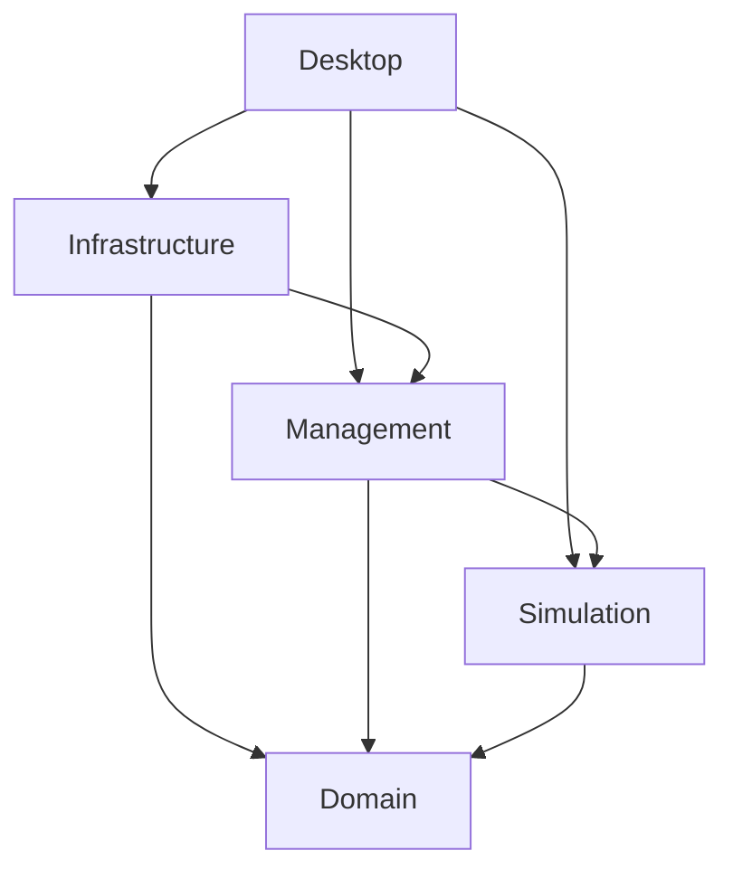

# Architecture

HockeySim is a single-player, offline management game. Game operations run
without a desktop UI; the user manages a team rather than directly controlling
athletes during matches. A future match viewer may present simulation output.

## Project responsibilities

| Project | Responsibility |
| --- | --- |
| `HockeySim.Domain` | Domain objects, value types, and invariants that must always hold. Controlled operations protect validity; callers cannot bypass them through mutable collections. |
| `HockeySim.Simulation` | Match calculations. Accepts match inputs and controlled randomness, maintains internal match state, and returns a result. |
| `HockeySim.Management` | Game workflows, world generation, season orchestration, and applying match results through Domain operations. Exposes game-state commands and read-only snapshots. |
| `HockeySim.Infrastructure` | Save/load, serialization, file access, and other external data access. Implements persistence contracts consumed by Management. |
| `HockeySim.Desktop` | Avalonia views, presentation state, view models, and startup wiring. Sends game-state changes to Management and displays its snapshots. |

Domain enforces validity; Management coordinates operations; Simulation
calculates match outcomes. Neither UI behavior nor storage details belong in
those core responsibilities.

## Dependencies and interaction

The intended project dependency direction is:


```mermaid
flowchart TD
    Desktop --> Management
    Desktop --> Infrastructure
    Desktop --> Simulation
    Infrastructure --> Management
    Infrastructure --> Domain
    Management --> Simulation
    Management --> Domain
    Simulation --> Domain
```

Management owns the persistence contracts it needs; Infrastructure implements
them. Domain has no dependency on the other application projects. Management
and Simulation have no dependency on Desktop or Infrastructure. Keep framework
and storage-specific types out of core interfaces.

Desktop's references to Infrastructure and Simulation serve startup composition.
Use ordinary constructors and manual wiring there. Views and view models use
Management's interface; they do not invoke the match engine, storage, or live
Domain mutation methods directly. Snapshots expose only read-only data, without
mutable references back into the game world. Shape snapshots for callers rather
than copying the entire model indiscriminately.

Simulation returns a match result instead of changing the persistent game world.
Management applies that result through Domain operations. See
[the ownership decision](adr/0001-headless-game-ownership.md).

## Randomness and saves

Within the same engine version, the same starting state, random state, and
sequence of management actions produce the same result. Preserve hidden random
state in saves so reloading and repeating actions does not reroll an outcome.
Keep outcome-affecting randomness and time inputs under explicit control.
Simulation owns the single deterministic generator (`ControlledRandom`) and its
persistable `RandomState`; Management uses the same generator for world
generation and passes the state to and from match simulation.
Reproducibility is not a promise across engine versions or protection against
editing local saves. See [the rationale](adr/0002-reproducible-saves.md).
The engine version is the release version, taken from the Git tag; a source
build is `0.0.0-dev` and promises nothing beyond its own commit. It is
independent of the save format version: a release may or may not change the
save format. See [the release decision](adr/0005-self-contained-desktop-builds.md).

Pre-release saves may become incompatible. The save format is versioned, and a
save from another version is rejected as unsupported rather than migrated. Each
game is saved as one Brotli-compressed JSON file; see
[the format decision](adr/0004-local-save-format.md). Establish a longer-term
compatibility policy before the first stable release.

## Repository structure

Production projects live in `src/`; matching test projects live in `tests/`:

```text
src/HockeySim.<Responsibility>/
tests/HockeySim.<Responsibility>.Tests/
docs/
  adr/
  agents/
  areas/
CONTEXT.md
```

Use the five responsibilities in the table above. Add projects to
`HockeySim.slnx` when they are scaffolded. Within a project, group related files
by feature or domain responsibility, such as a view and view model together
under `Roster/`. Keep small projects flat until grouping is useful. Name folders
for their responsibility instead of creating generic `Helpers` or `Managers`
collections. Namespaces follow the owning project and folder.


## Current implementation

All five projects exist. A new game generates a fictional league, its players,
a seven-match preseason, and a balanced 84-game schedule. Preseason matches
count toward nothing. Each league day plays its matches through the
event-based engine, applies the results to the season, and updates standings,
season totals, and player health (injuries and hidden wear). AI teams replace injured players
from their healthy scratches, and the user must replace their own before playing. Games save to and load from local files. The Desktop app
covers the new-game flow, team management pages, daily advancement, box scores,
and named saves.

Each area has its own document. Every one starts with a code map (which file
holds what) and a test map. Read the one for the area a task touches, rather
than every document:

| Area | Document | Read when the task touches |
| --- | --- | --- |
| Match engine | [match-engine.md](areas/match-engine.md) | Anything in `HockeySim.Simulation`: play, penalties, goalie pulls, injuries, statistics, xG, tuning |
| Season | [season.md](areas/season.md) | Schedule, advancing days, completed matches and box-score rules, standings, season totals, player health |
| Players and lineups | [players-and-lineups.md](areas/players-and-lineups.md) | World generation, ratings, biographies, lineups and units, the inbox |
| Saves | [saves.md](areas/saves.md) | The save model, loading, save files, format versions |
| Desktop | [desktop.md](areas/desktop.md) | Any Avalonia view or view model, the game session, release builds |

A change that adds a statistic or a lineup field often crosses areas: engine,
then completed-match rules (season), then saves, then Desktop. The code maps
say which files each step touches.

### Keeping the area documents useful

The area documents describe how the game works now, not how it got there.
Issues, PRs, and Git history hold the history.

- When behaviour changes, rewrite the affected paragraph in place. Do not
  append a new paragraph describing the change.
- When files are added, moved, renamed, or split, update the code map in the
  same change.
- Give new test files one line in the area's test map. Do not list individual
  checks there or in [testing](testing.md); test names record them.
- When an area document grows past roughly 300 lines, or a single subsystem
  grows enough to need its own map, propose splitting it.
